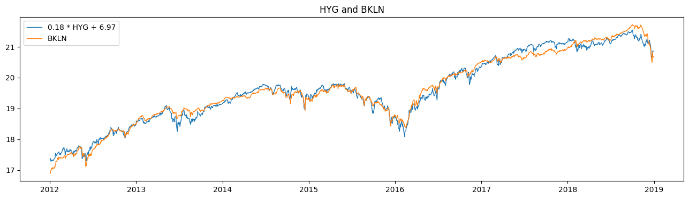

# CointAnalysis

[](https://pypi.org/project/cointanalysis/)
[](https://pypi.org/project/cointanalysis/)
[](https://travis-ci.com/simaki/cointanalysis)
[](https://pypi.org/project/cointanalysis/)
[](LICENSE)
[](https://github.com/psf/black)

Python library for cointegration analysis.



## Features

- Carry out cointegration test
- Evaluate spread between cointegrated time-series
- Generate cointegrated time-series artificially
- Based on scikit-learn API

## Installation

```sh
$ pip install cointanalysis
```

## What is cointegration?

See [Hamilton's book][hamilton].

## How to use

[](https://colab.research.google.com/github/simaki/cointanalysis/blob/master/examples/howto/howto.ipynb)

Let us see how the main class `CointAnalysis` works using two ETFs, [HYG][hyg] and [BKLN][bkln], as examples.
Since they are both connected with liabilities of low-rated companies, these prices behave quite similarly.


### Cointegration test

The method `test` carries out a cointegration test.
The following code gives p-value for null-hypothesis that there is no cointegration.

```python
from cointanalysis import CointAnalysis

hyg = ...   # Fetch historical price of high-yield bond ETF
bkln = ...  # Fetch historical price of bank loan ETF
X = np.array([hyg, bkln]).T

coint = CointAnalysis()
coint.test(X)

coint.pvalue_
# 0.0055
```

The test has rejected the null-hypothesis by the p-value of 0.55%, which implies cointegration.

[hyg]: https://www.bloomberg.com/quote/HYG:US
[bkln]: https://www.bloomberg.com/quote/BKLN:US

### Get spread

The method `fit` finds the cointegration equation.

```python
coint = CointAnalysis().fit(X)

coint.coef_
# np.array([-0.18  1.])
coint.mean_
# 6.97
coint.std_
# 0.15
```

This means that spread "-0.18 HYG + BKLN" has a mean 6.97 and a standard deviation of 0.15.

In fact, the prices adjusted with these parameters clarifies the similarities of these ETFs:


The time-series of spread is obtained by applying the method `transform` subsequently.
The mean and the standard deviation are automatically adjusted (unless you pass parameters asking not to).

```python
spread = coint.transform(X)
# returns (-0.18 * hyg + 1. * bkln - 7.00) / 0.15

spread = coint.transform(X, adjust_mean=False, adjust_std=False)
# returns -0.18 * hyg + 1. * bkln
```

The method `fit_transform` carries out `fit` and `transform` at once.

```python
spread = coint.fit_transform(X)
```

The result looks like this:


## Acknowledgements

- [statsmodels](https://www.statsmodels.org/)

## References

- [J. D. Hamilton, "Time Series Analysis", (1994)][hamilton].

[hamilton]: https://press.princeton.edu/books/hardcover/9780691042893/time-series-analysis
[statsmodels-aeg]: https://www.statsmodels.org/stable/generated/statsmodels.tsa.stattools.coint.html
